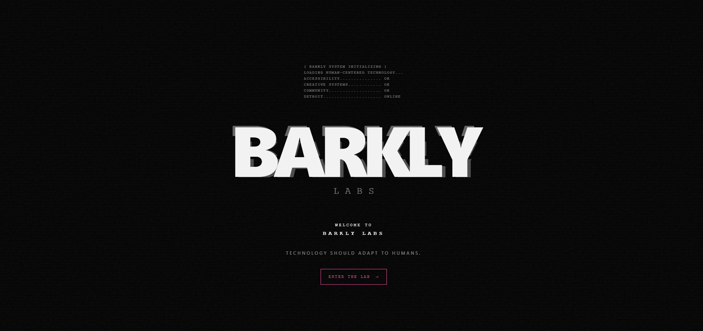

# 🐾 BARKLY LABS 💗

### `HUMAN-CENTERED TECHNOLOGY • OPEN RESEARCH • WEIRD IDEAS`

> 🧠 **Can we make computers front-load the hard stuff for humans?**

Barkly Labs is an experimental technology laboratory building
software, AI, documentation systems, hardware, research tools,
and infrastructure designed around **people first.**

We like complicated technology.

We just don't think humans should have to suffer through it. 🐾

---

<p align="center">
  
</p>

<p align="center">
  🖤 <b>WELCOME TO BARKLY LABS</b> 💗
</p>

---

## 🐾 WHAT IS BARKLY?

Barkly Labs is a place to **build weird things seriously.**

We're interested in the space where:

🧠 Artificial Intelligence  
💻 Software Engineering  
🔬 Research  
🛠️ Hardware  
📚 Documentation  
🤖 Robotics  
🎨 Human-centered Design  
🌐 Open Source  
🧪 Experimentation  

...all smash into each other.

The goal isn't to make technology complicated.

The goal is to take complicated things and make them **useful.**

> 💗 **Technology should help.**

---

# 🧪 THE LAB

Barkly isn't one project.

It's an ecosystem.

```text
                         🐾 BARKLY LABS
                               │
             ┌─────────────────┼─────────────────┐
             │                 │                 │
            🧠                📚                🧪
          CYN-X          BARKLY DOCS          LAAS
             │                 │                 │
        INTELLIGENCE      UNDERSTANDING      LABORATORY
             │                 │                 │
             └─────────────────┼─────────────────┘
                               │
                         🚀 FUTURE SYSTEMS